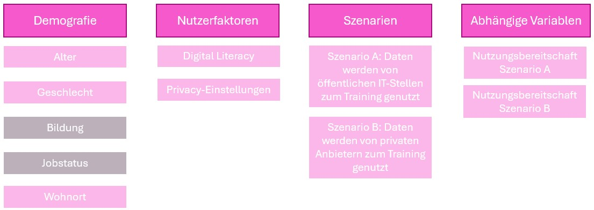

* Annika
* Maike
* Anastasiya
* Henrik 
* Marie 

## Forschungsfrage
"Welche Faktoren beeinflussen die Nutzungsbereitschaft von innovativen Services der Kommunalverwaltung?"

## Faktorenraum

## Validierte Messinstrumente

[Technikakzeptanz aus zis](https://zis.gesis.org/skala/Neyer-Felber-Gebhardt-Kurzskala-Technikbereitschaft-%28TB,-technology-commitment%29?redirect_url=https%253A%252F%252Fzis.gesis.org%252Fsearch%253Fsource%253D%257B%2522query%2522%253A%257B%2522bool%2522%253A%257B%2522must%2522%253A%255B%257B%2522query_string%2522%253A%257B%2522query%2522%253A%2522technikakzeptanz%2522%252C%2522default_operator%2522%253A%2522AND%2522%257D%257D%255D%252C%2522filter%2522%253A%255B%257B%2522term%2522%253A%257B%2522type%2522%253A%2522zis_scales%2522%257D%257D%255D%257D%257D%257D&lang=de)

[Digital literacy](https://zis.gesis.org/skala/Schauffel-Schmidt-Peiffer-Ellwart-ICT-Self-Concept-Scale-%28ICT-SC25%29?redirect_url=https%253A%252F%252Fzis.gesis.org%252Fsearch%253Fsource%253D%257B%2522query%2522%253A%257B%2522bool%2522%253A%257B%2522must%2522%253A%255B%257B%2522query_string%2522%253A%257B%2522query%2522%253A%2522digital%2520literacy%2522%252C%2522default_operator%2522%253A%2522AND%2522%257D%257D%255D%252C%2522filter%2522%253A%255B%257B%2522term%2522%253A%257B%2522type%2522%253A%2522zis_scales%2522%257D%257D%255D%257D%257D%257D&lang=de)
"General" also I1-5 bleiben drin. "Communicate": I7, I9 raus. "Proccess and Store": I12 weg. "Generate Content": I15, I17 raus. "Safe application": I18 raus. "Solve problems": I23, I25 raus. 

## Hypothesen

### Unterschiedshypothesen
1. LandbewohnerInnen und StadtbewohnerInnen unterscheiden sich in der Nutzungbereitschaft von innovativen Services der Kommunalverwaltung.
2. Männer und Frauen unterscheiden sich in der Nutzungbereitschaft von innovativen Services der Kommunalverwaltung.
3. Jüngere und ältere Menschen unterscheiden sich in der Nutzungbereitschaft von innovativen Services der Kommunalverwaltung.

#### Unterschiedshypothese für ANOVA
1. Bildung hat einen Einfluss auf die Nutzungbereitschaft von innovativen Services der Kommunalverwaltung.

### Zusammenhangshypothesen
1. Es gibt einen Zusammenhang zwischen der Technikaffinität und der  Nutzungbereitschaft von innovativen Services der Kommunalverwaltung.
2. Es gibt einen Zusammenhang zwischen Digital Literacy und  Nutzungbereitschaft von innovativen Services der Kommunalverwaltung.
3. Es gibt einen positiven Zusammenhang zwischen KI-Vertrauen und  Nutzungbereitschaft von innovativen Services der Kommunalverwaltung.

#### Zusammenhangshypothese für multiple lineare Regression
1. Die Nutzungbereitschaft von innovativen Services der Kommunalverwaltung ist abhängig von Einkommen, Bildungsabschluss und Jobstatus. 

