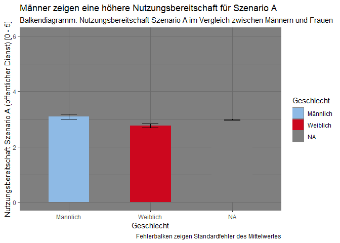
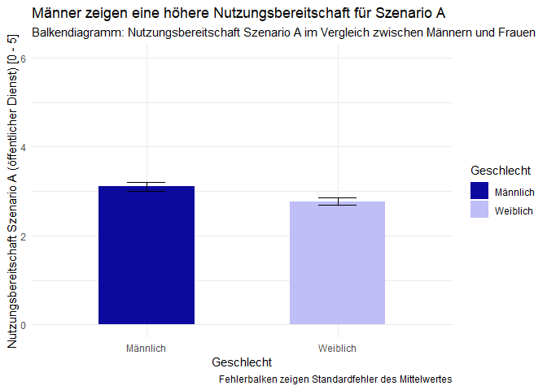
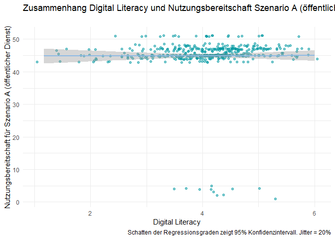
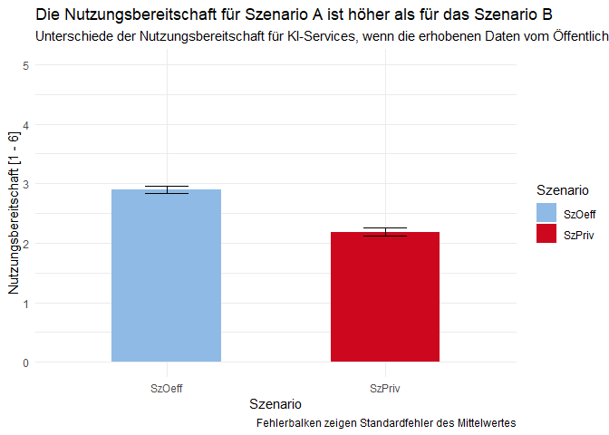
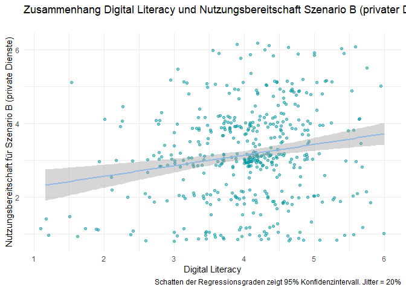
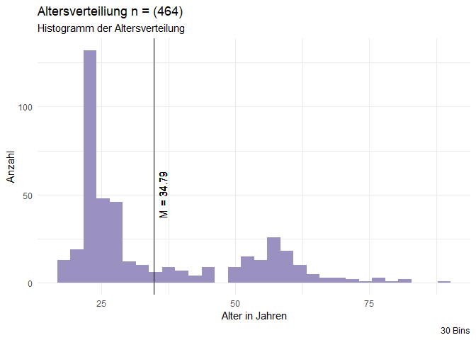

-   Annika
-   Maike
-   Anastasiya
-   Henrik
-   Marie

## Setup-Chunk

## Forschungsfrage

“Welche Faktoren beeinflussen die Nutzungsbereitschaft von innovativen
Services der Kommunalverwaltung bei Weitergabe der Daten an private oder
öffentliche Träger?”

## Faktorenraum

<figure>

<figcaption aria-hidden="true">Faktorenraum</figcaption>
</figure>

## Validierte Messinstrumente

[Digital
literacy](https://zis.gesis.org/skala/Schauffel-Schmidt-Peiffer-Ellwart-ICT-Self-Concept-Scale-%28ICT-SC25%29?redirect_url=https%253A%252F%252Fzis.gesis.org%252Fsearch%253Fsource%253D%257B%2522query%2522%253A%257B%2522bool%2522%253A%257B%2522must%2522%253A%255B%257B%2522query_string%2522%253A%257B%2522query%2522%253A%2522digital%2520literacy%2522%252C%2522default_operator%2522%253A%2522AND%2522%257D%257D%255D%252C%2522filter%2522%253A%255B%257B%2522term%2522%253A%257B%2522type%2522%253A%2522zis_scales%2522%257D%257D%255D%257D%257D%257D&lang=de)

“General” also I1-5 bleiben drin. “Communicate”: I7, I9 raus. “Proccess
and Store”: I12 weg. “Generate Content”: I15, I17 raus. “Safe
application”: I18 raus. “Solve problems”: I23, I25 raus.

Items, die nicht die Nutzung von digitalen Services der
Kommunalverwaltung beeinflussen, wurden herausgekürzt. Dies umfasst
hauptsächlich kooperative und generative Szenarien, die wir im
Anwendungsfall nicht antizipieren. Die Skala wurde von 25 Items auf 17
Items gekürzt. Es wurde darauf geachtet, dass die Subskalen genug
Substanz (mindestens 3 Items) - und damit ihre Funktionalität behalten.

## Hypothesen

### Unterschiedshypothesen

1.  Männer und Frauen unterscheiden sich in der Nutzungsbereitschaft in
    Szenario A (öffentlicher Dienst).

<!-- -->

    ## 
    ##  Welch Two Sample t-test
    ## 
    ## data:  df_male$SzOeff and df_female$SzOeff
    ## t = 2.7526, df = 342.08, p-value = 0.006228
    ## alternative hypothesis: true difference in means is not equal to 0
    ## 95 percent confidence interval:
    ##  0.09443344 0.56726842
    ## sample estimates:
    ## mean of x mean of y 
    ##  4.091880  3.761029

1.  Männer und Frauen unterscheiden sich in der Nutzungsbereitschaft in
    Szenario B (privatwirtschaftliche Zwecke).

<!-- -->

    ## 
    ##  Welch Two Sample t-test
    ## 
    ## data:  df_male$SzPriv and df_female$SzPriv
    ## t = -0.65447, df = 312.85, p-value = 0.5133
    ## alternative hypothesis: true difference in means is not equal to 0
    ## 95 percent confidence interval:
    ##  -0.3503573  0.1754579
    ## sample estimates:
    ## mean of x mean of y 
    ##  3.119658  3.207108

1.  Die Nutzungsbereitschaft ist bei Szenario A (öffentlicher Dienst)
    höher, als bei Szenario B (privatwirtschaftliche Zwecke).

<!-- -->

    ## 
    ##  Paired t-test
    ## 
    ## data:  df$SzOeff and df$SzPriv
    ## t = 13.833, df = 463, p-value < 2.2e-16
    ## alternative hypothesis: true mean difference is not equal to 0
    ## 95 percent confidence interval:
    ##  0.6237313 0.8302917
    ## sample estimates:
    ## mean difference 
    ##       0.7270115

    #Feedback JRH: Ich würde das hier und das Diagramm in einen gemeinsamen Chunk schreiben. Und definitiv echo = FALSE sonst wird der Code mit abgedruckt. 

    df_WAP$Szenario %>% 
      recode(`1` = "SzOeff", `2` = "SzPriv") %>% 
      as.factor() -> df_WAP$Szenario

    #Feedback JRH: Diagramm prinzipiell super, ich würde aber für den Vortrag Balken- und Punktdiagramm nicht abwechseln. 

    df_WAP%>%
      group_by(Szenario) %>% 
      summarise(mean_Nutzungsbereitschaft = mean(Nutzungsbereitschaft), sem_Nutzungsbereitschaft = std.error(Nutzungsbereitschaft)) %>%
      ggplot() +
      aes(x = Szenario, y = mean_Nutzungsbereitschaft, weight = mean_Nutzungsbereitschaft, colour = Szenario, ymin = mean_Nutzungsbereitschaft - sem_Nutzungsbereitschaft, ymax = mean_Nutzungsbereitschaft + sem_Nutzungsbereitschaft) +
      geom_errorbar(width = 0.2, colour = rwthcolor$black) +
      geom_point(size = 5) +
      scale_colour_manual(values=c(rwthcolor$lightblue, rwthcolor$red)) + 
      ylim(3,4.1) +
      theme_gray() +
      labs(title = "Die Nutzungsbereitschaft für Szenario A ist höher als für das Szenario B", 
           subtitle = "Unterschiede der Nutzungsbereitschaft für KI-Services, wenn die erhobenen Daten vom Öffentlichen Dienst oder der Privatwirtschaft genutzt werden", 
           x = "Szenario",
           y = "Nutzungsbereitschaft [1 - 6]",
           fill = "Szenario",
           caption = "Fehlerbalken zeigen Standardfehler des Mittelwertes") +
      NULL

    ## Ignoring unknown labels:
    ## • fill : "Szenario"

#### Unterschiedshypothese für MANOVA

1.  LandbewohnerInnen und StadtbewohnerInnen unterscheiden sich in der
    Nutzungsbereitschaft in Szenario A (öffentlicher Dienst) und
    Szenario B (privatwirtschaftliche Zwecke).

### Zusammenhangshypothesen

1.  Es gibt einen Zusammenhang zwischen Digital Literacy und
    Nutzungsbereitschaft in Szenario A (öffentlicher Dienst).

<!-- -->

    ## 
    ##  Pearson's product-moment correlation
    ## 
    ## data:  df$DigLit and df$SzOeff
    ## t = 5.7053, df = 462, p-value = 2.077e-08
    ## alternative hypothesis: true correlation is not equal to 0
    ## 95 percent confidence interval:
    ##  0.1694784 0.3396517
    ## sample estimates:
    ##       cor 
    ## 0.2565522

    ## `geom_smooth()` using formula = 'y ~ x'

1.  Es gibt einen Zusammenhang zwischen Digital Literacy und
    Nutzungsbereitschaft in Szenario B (privatwirtschaftliche Zwecke).

<!-- -->

    ## 
    ##  Pearson's product-moment correlation
    ## 
    ## data:  df$DigLit and df$SzPriv
    ## t = 4.0152, df = 462, p-value = 6.929e-05
    ## alternative hypothesis: true correlation is not equal to 0
    ## 95 percent confidence interval:
    ##  0.09417119 0.27014507
    ## sample estimates:
    ##       cor 
    ## 0.1836289

    ## `geom_smooth()` using formula = 'y ~ x'

#### Zusammenhangshypothese für multiple lineare Regression

1.  Die Nutzungsbereitschaft von innovativen Services der
    Kommunalverwaltung in Szenario B (privatwirtschaftliche Zwecke) ist
    abhängig von Privacy-Einstellungen und Alter.  
2.  Die Nutzungsbereitschaft von innovativen Services der
    Kommunalverwaltung in Szenario A (öffentlicher Dienst Zwecke) ist
    abhängig von Privacy-Einstellungen und Alter.

## Operationalisierung

future text

## Poweranalyse

<figure>

<figcaption aria-hidden="true">Power</figcaption>
</figure>

antizipierte ProbandInnenanzahl: n=360  
wird für die Poweranalyse halbiert (Gruppenvergleich, daher wird die
Gruppe geteilt)  
Signifikanzniveau (wir sind SozialwissenschaftlerInnen): *α* = 0,05  
Power (1-(4 · *α*)): 0,8  
kleinste Effektstärke, die wir messen können (ausgerechnet):
d=0.2961082  
Poweranalysen, um herauszufinden, wie viele ProbandInnen wir je nach
antizipiertem Effekt brauchen.  
n(d=0.2; “schwach”)=786.8114  
n(d=0.5; “mittel”)=127.5312  
n(d=0.8; “hoch”)=51.04916

## Histogramm Altersverteilung

    ## Warning: Removed 37 rows containing non-finite outside the scale range
    ## (`stat_bin()`).

