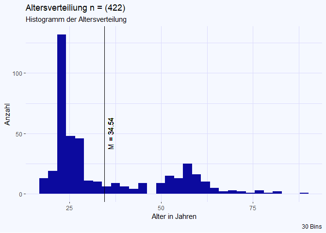
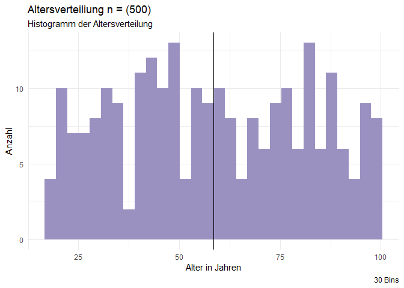
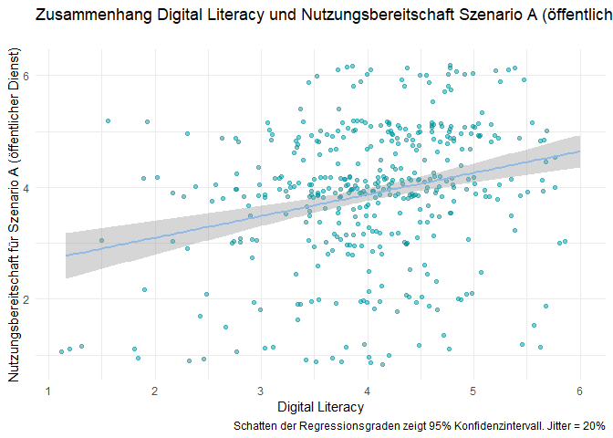
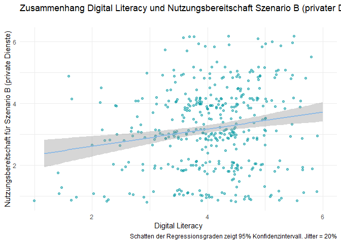

-   Annika
-   Maike
-   Anastasiya
-   Henrik
-   Marie

## Forschungsfrage

“Welche Faktoren beeinflussen die Nutzungsbereitschaft von innovativen
Services der Kommunalverwaltung bei Weitergabe der Daten an private oder
öffentliche Träger?”

## Faktorenraum

<figure>

<figcaption aria-hidden="true">Faktorenraum</figcaption>
</figure>

## Validierte Messinstrumente

[Digital
literacy](https://zis.gesis.org/skala/Schauffel-Schmidt-Peiffer-Ellwart-ICT-Self-Concept-Scale-%28ICT-SC25%29?redirect_url=https%253A%252F%252Fzis.gesis.org%252Fsearch%253Fsource%253D%257B%2522query%2522%253A%257B%2522bool%2522%253A%257B%2522must%2522%253A%255B%257B%2522query_string%2522%253A%257B%2522query%2522%253A%2522digital%2520literacy%2522%252C%2522default_operator%2522%253A%2522AND%2522%257D%257D%255D%252C%2522filter%2522%253A%255B%257B%2522term%2522%253A%257B%2522type%2522%253A%2522zis_scales%2522%257D%257D%255D%257D%257D%257D&lang=de)

<!-- #"General" also I1-5 bleiben drin. "Communicate": I7, I9 raus. "Proccess and Store": I12 weg. "Generate Content": I15, I17 raus. "Safe application": I18 raus. "Solve problems": I23, I25 raus.   -->

Items, die nicht die Nutzung von digitalen Services der
Kommunalverwaltung beeinflussen, wurden herausgekürzt. Dies umfasst
hauptsächlich kooperative und generative Szenarien, die wir im
Anwendungsfall nicht antizipieren. Die Skala wurde von 25 Items auf 18
Items gekürzt. Es wurde darauf geachtet, dass die Subskalen genug
Substanz (mindestens 3 Items) - und damit ihre Funktionalität behalten.

## Demografie

### Histogramm Altersverteilung

    ## Warning: Removed 1 row containing non-finite outside the scale range
    ## (`stat_bin()`).

### Deskriptive Statistiken

    jmv::descriptives(df, vars=c("Gender", "Age", "Edu", "Urban"), freq = TRUE)

    ## 
    ##  DESCRIPTIVES
    ## 
    ##  Descriptives                                                     
    ##  ──────────────────────────────────────────────────────────────── 
    ##                          Gender    Age         Edu    Urban       
    ##  ──────────────────────────────────────────────────────────────── 
    ##    N                        422         421    422          422   
    ##    Missing                    0           1      0            0   
    ##    Mean                            34.53919            2.289100   
    ##    Median                          26.00000            2.000000   
    ##    Standard deviation              15.79154           0.7747957   
    ##    Minimum                         18.00000            1.000000   
    ##    Maximum                         89.00000            3.000000   
    ##  ──────────────────────────────────────────────────────────────── 
    ## 
    ## 
    ##  FREQUENCIES
    ## 
    ##  Frequencies of Gender                                
    ##  ──────────────────────────────────────────────────── 
    ##    Gender      Counts    % of Total    Cumulative %   
    ##  ──────────────────────────────────────────────────── 
    ##    Männlich       153      36.25592        36.25592   
    ##    Weiblich       269      63.74408       100.00000   
    ##  ──────────────────────────────────────────────────── 
    ## 
    ## 
    ##  Frequencies of Edu                                                     
    ##  ────────────────────────────────────────────────────────────────────── 
    ##    Edu                           Counts    % of Total    Cumulative %   
    ##  ────────────────────────────────────────────────────────────────────── 
    ##    (noch) kein Schulabschluss         2       0.47393         0.47393   
    ##    Hauptschulabschluss               10       2.36967         2.84360   
    ##    Realschulabschluss                52      12.32227        15.16588   
    ##    Abitur                           141      33.41232        48.57820   
    ##    Hochschulabschluss               217      51.42180       100.00000   
    ##  ──────────────────────────────────────────────────────────────────────

### Geschlecht

    ## 
    ##  DESCRIPTIVES
    ## 
    ##  Descriptives                     
    ##  ──────────────────────────────── 
    ##                          Gender   
    ##  ──────────────────────────────── 
    ##    N                        422   
    ##    Missing                    0   
    ##    Mean                           
    ##    Median                         
    ##    Standard deviation             
    ##    Minimum                        
    ##    Maximum                        
    ##  ──────────────────────────────── 
    ## 
    ## 
    ##  FREQUENCIES
    ## 
    ##  Frequencies of Gender                                
    ##  ──────────────────────────────────────────────────── 
    ##    Gender      Counts    % of Total    Cumulative %   
    ##  ──────────────────────────────────────────────────── 
    ##    Männlich       153      36.25592        36.25592   
    ##    Weiblich       269      63.74408       100.00000   
    ##  ────────────────────────────────────────────────────

### Bildung

    ## 
    ##  DESCRIPTIVES
    ## 
    ##  Descriptives                  
    ##  ───────────────────────────── 
    ##                          Edu   
    ##  ───────────────────────────── 
    ##    N                     422   
    ##    Missing                 0   
    ##    Mean                        
    ##    Median                      
    ##    Standard deviation          
    ##    Minimum                     
    ##    Maximum                     
    ##  ───────────────────────────── 
    ## 
    ## 
    ##  FREQUENCIES
    ## 
    ##  Frequencies of Edu                                                     
    ##  ────────────────────────────────────────────────────────────────────── 
    ##    Edu                           Counts    % of Total    Cumulative %   
    ##  ────────────────────────────────────────────────────────────────────── 
    ##    (noch) kein Schulabschluss         2       0.47393         0.47393   
    ##    Hauptschulabschluss               10       2.36967         2.84360   
    ##    Realschulabschluss                52      12.32227        15.16588   
    ##    Abitur                           141      33.41232        48.57820   
    ##    Hochschulabschluss               217      51.42180       100.00000   
    ##  ──────────────────────────────────────────────────────────────────────

### Wohnort

    ## 
    ##  DESCRIPTIVES
    ## 
    ##  Descriptives                     
    ##  ──────────────────────────────── 
    ##                          urban2   
    ##  ──────────────────────────────── 
    ##    N                        422   
    ##    Missing                    0   
    ##    Mean                           
    ##    Median                         
    ##    Standard deviation             
    ##    Minimum                        
    ##    Maximum                        
    ##  ──────────────────────────────── 
    ## 
    ## 
    ##  FREQUENCIES
    ## 
    ##  Frequencies of urban2                              
    ##  ────────────────────────────────────────────────── 
    ##    urban2    Counts    % of Total    Cumulative %   
    ##  ────────────────────────────────────────────────── 
    ##    1             83      19.66825        19.66825   
    ##    2            134      31.75355        51.42180   
    ##    3            205      48.57820       100.00000   
    ##  ──────────────────────────────────────────────────

## Hypothesen

### Unterschiedshypothesen

1.  Männer und Frauen unterscheiden sich in der Nutzungsbereitschaft in
    Szenario A (öffentlicher Dienst).

<!-- -->

    ## 
    ##  Welch Two Sample t-test
    ## 
    ## data:  df_male$SzOeff and df_female$SzOeff
    ## t = 2.7405, df = 332.2, p-value = 0.006466
    ## alternative hypothesis: true difference in means is not equal to 0
    ## 95 percent confidence interval:
    ##  0.09393775 0.57182182
    ## sample estimates:
    ## mean of x mean of y 
    ##  4.102397  3.769517

1.  Männer und Frauen unterscheiden sich in der Nutzungsbereitschaft in
    Szenario B (privatwirtschaftliche Zwecke).

<!-- -->

    ## 
    ##  Welch Two Sample t-test
    ## 
    ## data:  df_male$SzPriv and df_female$SzPriv
    ## t = -0.43766, df = 308.84, p-value = 0.6619
    ## alternative hypothesis: true difference in means is not equal to 0
    ## 95 percent confidence interval:
    ##  -0.3231118  0.2055295
    ## sample estimates:
    ## mean of x mean of y 
    ##  3.148148  3.206939

1.  Die Nutzungsbereitschaft ist bei Szenario A (öffentlicher Dienst)
    höher, als bei Szenario B (privatwirtschaftliche Zwecke).

<!-- -->

    ## 
    ##  Paired t-test
    ## 
    ## data:  df$SzOeff and df$SzPriv
    ## t = 12.397, df = 421, p-value < 2.2e-16
    ## alternative hypothesis: true mean difference is not equal to 0
    ## 95 percent confidence interval:
    ##  0.5928704 0.8162923
    ## sample estimates:
    ## mean difference 
    ##       0.7045814

#### Unterschiedshypothese für MANOVA

1.  LandbewohnerInnen und StadtbewohnerInnen unterscheiden sich in der
    Nutzungsbereitschaft in Szenario A (öffentlicher Dienst) und
    Szenario B (privatwirtschaftliche Zwecke).

<!-- -->

    ## 
    ##  MANCOVA
    ## 
    ##  Multivariate Tests                                                             
    ##  ────────────────────────────────────────────────────────────────────────────── 
    ##                              value        F           df1    df2    p           
    ##  ────────────────────────────────────────────────────────────────────────────── 
    ##    Urban    Wilks' Lambda    0.9746559    2.699890      4    836    0.0296067   
    ##  ────────────────────────────────────────────────────────────────────────────── 
    ## 
    ## 
    ##  Univariate Tests                                                                                      
    ##  ───────────────────────────────────────────────────────────────────────────────────────────────────── 
    ##                 Dependent Variable    Sum of Squares    df     Mean Square    F            p           
    ##  ───────────────────────────────────────────────────────────────────────────────────────────────────── 
    ##    Urban        SzOeff                     0.4628712      2      0.2314356    0.1526563    0.8584724   
    ##                 SzPriv                    10.0084861      2      5.0042431    2.9193733    0.0550662   
    ##    Residuals    SzOeff                   635.2277554    419      1.5160567                             
    ##                 SzPriv                   718.2287440    419      1.7141497                             
    ##  ─────────────────────────────────────────────────────────────────────────────────────────────────────

### Zusammenhangshypothesen

1.  Es gibt einen Zusammenhang zwischen Digital Literacy und
    Nutzungsbereitschaft in Szenario A (öffentlicher Dienst).

<!-- -->

    ## 
    ##  Pearson's product-moment correlation
    ## 
    ## data:  df$DigLit and df$SzOeff
    ## t = 5.587, df = 420, p-value = 4.159e-08
    ## alternative hypothesis: true correlation is not equal to 0
    ## 95 percent confidence interval:
    ##  0.1718763 0.3496987
    ## sample estimates:
    ##       cor 
    ## 0.2630198

    ## `geom_smooth()` using formula = 'y ~ x'

1.  Es gibt einen Zusammenhang zwischen Digital Literacy und
    Nutzungsbereitschaft in Szenario B (privatwirtschaftliche Zwecke).

<!-- -->

    ## 
    ##  Pearson's product-moment correlation
    ## 
    ## data:  df$DigLit and df$SzPriv
    ## t = 3.6786, df = 420, p-value = 0.000265
    ## alternative hypothesis: true correlation is not equal to 0
    ## 95 percent confidence interval:
    ##  0.08260756 0.26761888
    ## sample estimates:
    ##       cor 
    ## 0.1766733

    ## `geom_smooth()` using formula = 'y ~ x'

#### Zusammenhangshypothese für multiple lineare Regression

1.  Die Nutzungsbereitschaft von innovativen Services der
    Kommunalverwaltung in Szenario B (privatwirtschaftliche Zwecke) ist
    abhängig von Privacy-Einstellungen und Alter.

<!-- -->

    ## 
    ##  LINEAR REGRESSION
    ## 
    ##  Model Fit Measures                                                                          
    ##  ─────────────────────────────────────────────────────────────────────────────────────────── 
    ##    Model    R            R²            Adjusted R²    F           df1    df2    p            
    ##  ─────────────────────────────────────────────────────────────────────────────────────────── 
    ##        1    0.2989801    0.08938908     0.08721579    41.13066      1    419    < .0000001   
    ##        2    0.3044769    0.09270620     0.08836508    21.35537      2    418    < .0000001   
    ##  ─────────────────────────────────────────────────────────────────────────────────────────── 
    ##    Note. Models estimated using sample size of N=421
    ## 
    ## 
    ##  Model Comparisons                                                             
    ##  ───────────────────────────────────────────────────────────────────────────── 
    ##    Model         Model    ΔR²            F           df1    df2    p           
    ##  ───────────────────────────────────────────────────────────────────────────── 
    ##        1    -        2    0.003317114    1.528230      1    418    0.2170725   
    ##  ───────────────────────────────────────────────────────────────────────────── 
    ## 
    ## 
    ##  MODEL SPECIFIC RESULTS
    ## 
    ##  MODEL 1
    ## 
    ##  Model Coefficients - SzPriv                                                             
    ##  ─────────────────────────────────────────────────────────────────────────────────────── 
    ##    Predictor    Estimate      SE            t            p             Stand. Estimate   
    ##  ─────────────────────────────────────────────────────────────────────────────────────── 
    ##    Intercept     4.6221703    0.23140014    19.974795    < .0000001                      
    ##    Priv         -0.4014659    0.06259878    -6.413319    < .0000001         -0.2989801   
    ##  ─────────────────────────────────────────────────────────────────────────────────────── 
    ## 
    ## 
    ##  MODEL 2
    ## 
    ##  Model Coefficients - SzPriv                                                                
    ##  ────────────────────────────────────────────────────────────────────────────────────────── 
    ##    Predictor    Estimate        SE             t            p             Stand. Estimate   
    ##  ────────────────────────────────────────────────────────────────────────────────────────── 
    ##    Intercept     4.755651868    0.255220311    18.633516    < .0000001                      
    ##    Priv         -0.392202088    0.063006578    -6.224780    < .0000001        -0.29208110   
    ##    Age          -0.004820904    0.003899726    -1.236216     0.2170725        -0.05800612   
    ##  ──────────────────────────────────────────────────────────────────────────────────────────

1.  Die Nutzungsbereitschaft von innovativen Services der
    Kommunalverwaltung in Szenario A (öffentlicher Dienst Zwecke) ist
    abhängig von Privacy-Einstellungen und Alter.

<!-- -->

    ## 
    ##  LINEAR REGRESSION
    ## 
    ##  Model Fit Measures                                                                          
    ##  ─────────────────────────────────────────────────────────────────────────────────────────── 
    ##    Model    R            R²            Adjusted R²    F            df1    df2    p           
    ##  ─────────────────────────────────────────────────────────────────────────────────────────── 
    ##        1    0.1852658    0.03432341     0.03201869    14.892675      1    419    0.0001317   
    ##        2    0.2008684    0.04034812     0.03575649     8.787309      2    418    0.0001827   
    ##  ─────────────────────────────────────────────────────────────────────────────────────────── 
    ##    Note. Models estimated using sample size of N=421
    ## 
    ## 
    ##  Model Comparisons                                                             
    ##  ───────────────────────────────────────────────────────────────────────────── 
    ##    Model         Model    ΔR²            F           df1    df2    p           
    ##  ───────────────────────────────────────────────────────────────────────────── 
    ##        1    -        2    0.006024717    2.624214      1    418    0.1059988   
    ##  ───────────────────────────────────────────────────────────────────────────── 
    ## 
    ## 
    ##  MODEL SPECIFIC RESULTS
    ## 
    ##  MODEL 1
    ## 
    ##  Model Coefficients - SzOeff                                                             
    ##  ─────────────────────────────────────────────────────────────────────────────────────── 
    ##    Predictor    Estimate      SE            t            p             Stand. Estimate   
    ##  ─────────────────────────────────────────────────────────────────────────────────────── 
    ##    Intercept     4.7229943    0.22189770    21.284557    < .0000001                      
    ##    Priv         -0.2316549    0.06002816    -3.859103     0.0001317         -0.1852658   
    ##  ─────────────────────────────────────────────────────────────────────────────────────── 
    ## 
    ## 
    ##  MODEL 2
    ## 
    ##  Model Coefficients - SzOeff                                                                
    ##  ────────────────────────────────────────────────────────────────────────────────────────── 
    ##    Predictor    Estimate        SE             t            p             Stand. Estimate   
    ##  ────────────────────────────────────────────────────────────────────────────────────────── 
    ##    Intercept     4.890507590    0.244420642    20.008570    < .0000001                      
    ##    Priv         -0.220029160    0.060340449    -3.646462     0.0002994        -0.17596813   
    ##    Age          -0.006050014    0.003734709    -1.619943     0.1059988        -0.07817393   
    ##  ──────────────────────────────────────────────────────────────────────────────────────────

service comment (nur so 90 % garantie auf richtigkeit): adjusted R^2
stellt dar, wie viel Prozent der Varianz der abhängigen Variable (den
Variablen) durch die unabhängige Variable erklärt wird. Diese
Betrachtung geht über den Mittelwertsvergleich hinaus. Bsp.: die Varianz
der Nutzungsbereitschaft wird zu x % von Privacy-EInstellungen erklärt.
Das wird durch das “Estimate” berechnet. Sollen Variablen verglichen
werden, müssen die Estimates bereinigt werden (da bspw. Alter immer
höhere Werte hat als eine Skala), betrachtet man die “standadisierten
Estimates”. aus mehreren Variablen setzen sich Modelle zusammen. Das
beste Modell hat die wenigsten Variablen und das größte stand. Estimate.
Wir machen basically ein lineares Gleichungssystem mit den Variablen, um
das Intercept zu berechnen. Das funktioniert nicht perfekt, daher kommt
der Fehlerterm zustande.

## Operationalisierung

future text

## Poweranalyse

<figure>

<figcaption aria-hidden="true">Power</figcaption>
</figure>

antizipierte ProbandInnenanzahl: n=360  
wird für die Poweranalyse halbiert (Gruppenvergleich, daher wird die
Gruppe geteilt)  
Signifikanzniveau (wir sind SozialwissenschaftlerInnen): *α* = 0,05  
Power (1-(4 · *α*)): 0,8  
kleinste Effektstärke, die wir messen können (ausgerechnet):
d=0.2961082  
Poweranalysen, um herauszufinden, wie viele ProbandInnen wir je nach
antizipiertem Effekt brauchen.  
n(d=0.2; “schwach”)=786.8114  
n(d=0.5; “mittel”)=127.5312  
n(d=0.8; “hoch”)=51.04916

## Descriptives

    ##        alpha mean   sd  min max
    ## AD      0.85 4.47 1.22 1.00   6
    ## Priv    0.83 3.57 0.98 1.00   6
    ## DigLit  0.95 4.04 0.84 1.17   6
    ## SzOeff  0.97 3.89 1.23 1.00   6
    ## SzPriv  0.97 3.19 1.32 1.00   6
